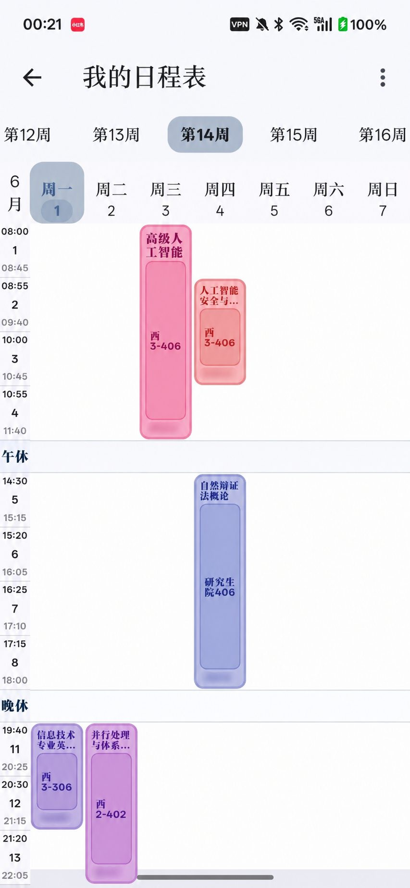

# GXU 研课表

面向广西大学研究生的非官方开源校园信息查询应用。课表、成绩、选课、空闲教室与校园网用量，集中在一个入口里。

[](https://github.com/GaleBird/traintime-pda-gxu/releases)
[](LICENSE)
[](#构建)
[](https://flutter.dev)

> [!IMPORTANT]
> **本项目是非官方应用，不代表广西大学官方立场，也不由学校任何部门维护或背书。**
> 所有数据均来自学校各信息系统的公开接口，应用只做本地展示与整理。请自行判断信息准确性，教务口径一律以学校官方系统为准。

## 界面预览

| 门户与首页 | 课表与日程 | 空闲教室 |
| :---: | :---: | :---: |
|  |  |  |

| 选课情况 | 校园网用量 | |
| :---: | :---: | :---: |
|  |  | |

## 下载

| 渠道 | 说明 |
| :--- | :--- |
| [官网 gxu.app](https://gxu.app/downloads/) | **推荐**。国内直链，自动匹配版本与架构 |
| [官网 Android 直链](https://gxu.app/download/android) | 直接下载 Android 包 |
| [GitHub Releases](https://github.com/GaleBird/traintime-pda-gxu/releases) | 备用渠道，附发布说明与历史版本 |

当前发布的预编译包**只有 Android**（`arm64-v8a` / `armeabi-v7a` / `x86_64` 三种 ABI）。iOS、Linux、Windows 目前需要自行从源码构建，见 [构建](#构建)。

安装时如果系统提示"未知来源"或"已阻止安装"，属于 Android 对非应用商店包的常规提示，需要在系统设置里为该来源授权。若已装过上游 XDYou，请先卸载，两者签名不同无法覆盖安装。

## 功能

- **课表与日程** —— GXU 原生日程表，含上课提醒与通知
- **成绩查询** —— 含学分绩点计算
- **选课情况** —— 选课结果与学位课状态
- **空闲教室** —— 各教学楼栋空闲教室检索
- **校园网用量** —— 网费余额、已用流量与套餐状态
- **工具箱** —— 常用校园入口聚合

## 反馈

- **Bug 与功能建议**：[GitHub Issues](https://github.com/GaleBird/traintime-pda-gxu/issues)（当前欢迎提交）
- **安全问题**：请勿开到公开 Issue，先用 Issue 说明情况并注明"需要私密沟通"，维护者会另开渠道对接
- **上游相关问题**：属于上游代码本身的缺陷，请提到 [上游仓库](https://github.com/BenderBlog/traintime_pda)

提问前建议先看 [`docs/faq.md`](docs/faq.md)。提交 Issue 时请附上应用版本（设置页可见，形如 `1.0.7+51`）、系统版本与复现步骤；涉及页面解析失败的问题，请说明是哪个功能。

## 构建

项目使用仓库内固定的 Flutter SDK（`.flutter/` 是 git submodule），请优先使用它而不是系统的 Flutter：

```bash
git submodule update --init --recursive
.flutter/bin/flutter pub get
.flutter/bin/flutter analyze
.flutter/bin/flutter test
```

运行与构建：

```bash
.flutter/bin/flutter run -d windows          # 或 android / ios / linux
.flutter/bin/flutter build apk --release --split-per-abi
.flutter/bin/flutter build linux --release
```

环境要求：

- Flutter 3.x（用仓库内的 `.flutter/`）
- Android 构建需 Android SDK 与 JDK 17
- Linux 构建需 `clang`、`cmake`、`ninja-build`、`libgtk-3-dev`
- Windows 构建需 Visual Studio 的 C++ 桌面开发组件

生成代码改动后需重跑 build_runner：

```bash
dart run build_runner build --delete-conflicting-outputs
```

安全相关改动后跑一遍审计：

```bash
.flutter/bin/dart run tool/security_audit.dart
```

## 版本与发布

- `pubspec.yaml` 的 `version` 是版本名，`+build` 是平台构建号
- **发布时 `+build` 必须单调递增**，否则应用内更新判断会失效
- 发布 tag 形如 `v1.0.7+51`，push `v*` tag 触发构建、签名并上传 APK 到 GitHub Release

## 开源与来源说明

- 上游开发者与历届贡献者的功能基础与开源代码是项目得以存在的前提，一并致谢
- 仓库保留 `LICENSE` 与源码文件头部的版权说明
- 上游文档存档见 [`docs/xdyou_eula.md`](docs/xdyou_eula.md) 与 [`docs/contributors.md`](docs/contributors.md)

## 授权

本项目源代码以 `MPL-2.0` 为主，部分文件带有 `MIT` 或 `Apache-2.0` 授权；具体以文件头部的 `SPDX-License-Identifier` 为准。
